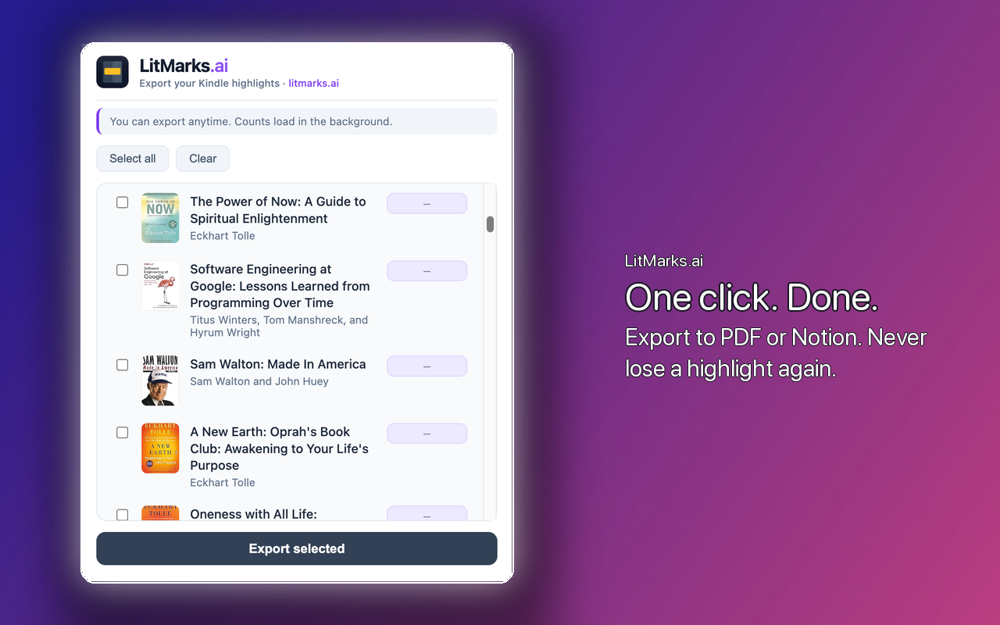
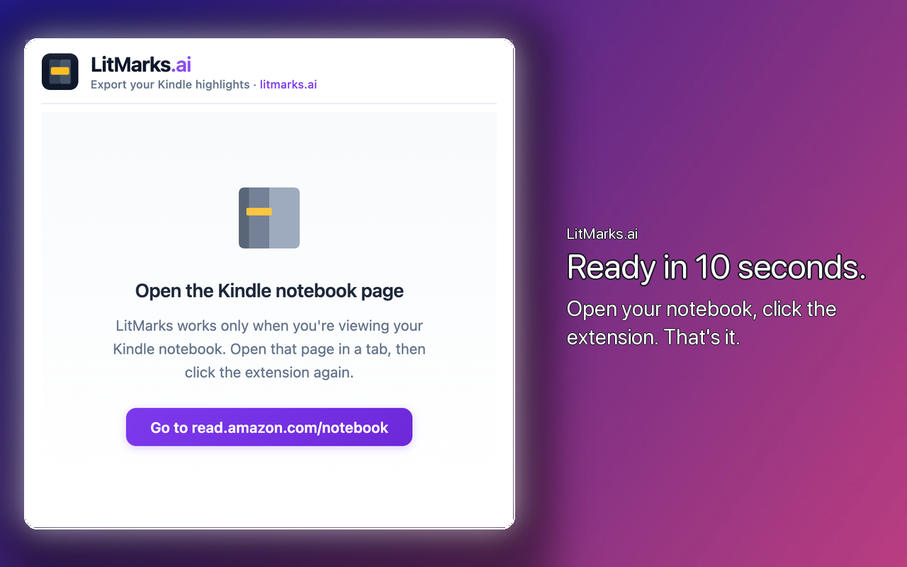

<div align="center">
  
  <h1>LitMarks.ai</h1>
  <p>Export your Kindle highlights from Amazon and turn them into useful things you'll actually check.</p>
  <p>
    
    <strong>
      <a href="https://chrome.google.com/webstore/detail/bljccpocaddlmlklnmackbdiffpgjmda">
         Install from Chrome Web Store
      </a>
    </strong>
  </p>
</div>

---

## Screenshots

<p align="center">
  
</p>
<p align="center">
  
</p>

---

## Features

| | Feature |
|---|--------|
| 📚 | **Select books** — Choose which books to export. Use Select all or Clear for bulk actions. |
| 📄 | **JSON export** — Structured output with titles, authors, highlights, colors, and locations. |
| ⚡ | **One-click** — Works directly on the Kindle notebook page. No extra steps. |

---

## How it works

1. Open [read.amazon.com/notebook](https://read.amazon.com/notebook) and log in.
2. Click the LitMarks icon in the Chrome toolbar.
3. Select the books you want and click Export selected.
4. Download the JSON file when done.

---

## Output format

Download the JSON file and use it in any integration you want—Notion, Obsidian, your own app, or anywhere else.

```json
{
  "extractedAt": "2025-02-06T...",
  "books": [
    {
      "asin": "B00LMGLXTS",
      "title": "Hooked: How to Build Habit-Forming Products",
      "author": "Nir Eyal and Ryan Hoover",
      "highlights": [
        {
          "text": "...",
          "color": "yellow",
          "location": "75"
        }
      ]
    }
  ]
}
```

---

## Coming soon

Account, cloud sync, and AI-powered insights—your highlights, supercharged.

| | Upcoming |
|---|----------|
| 👤 | **Create account** — Sign up and sync your highlights to the cloud. |
| ☁️ | **Collect your highlights** — All your book highlights in one place, automatically. |
| ✨ | **AI-powered insights** — Turn highlights into useful information—summaries, connections, and more. |

---

## Privacy

🔒 We do not collect, store, or transmit any of your data. All processing happens locally in your browser. Book titles, authors, highlights, and notes are read from the Kindle notebook page, processed only in memory, and export files are saved directly to your device when you choose to download.

The extension requests access only to `https://read.amazon.com/*` (Kindle notebook) and `https://m.media-amazon.com/*` (book covers). Access is used only when you are on the Kindle notebook page and click the extension.

---

<p align="center">
  <a href="https://litmarks.ai">litmarks.ai</a> · <a href="privacy.html">Privacy Policy</a>
</p>
